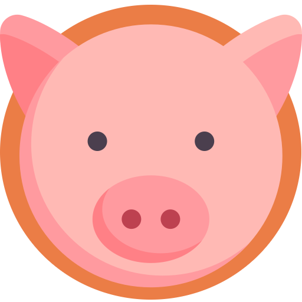
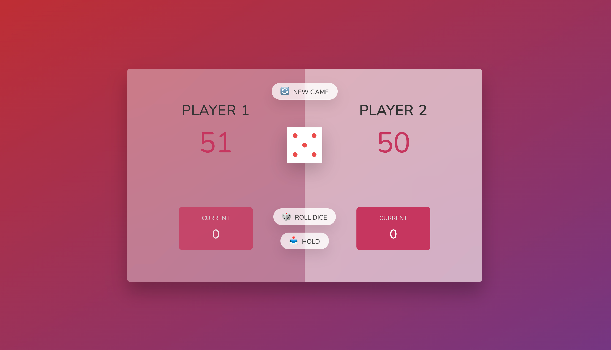

# Pig Game

The Pig Game is a simple and fun dice game built with HTML, CSS, and JavaScript. The objective of the game is to be the first player to reach the specified winning score.

## How to Play

1. The game is played with a single six-sided dice.
2. Each turn, a player can roll the dice as many times as they want. The total score for that turn is the sum of the rolled dice values.
3. If a player rolls a 1, all the points accumulated during that turn are lost, and it becomes the other player's turn.
4. The player can choose to "Hold" at any time during their turn to add the current turn's score to their total score.
5. The first player to reach the specified winning score wins the game.

## Getting Started

To play the Pig Game, simply open the `index.html` file in your web browser.

## Preview

## Demo

You can try out the game by visiting the [Pig Game Demo](https://example.com/pig-game-demo).

## Features

- Interactive and intuitive user interface.
- Two players can play against each other.
- Random dice roll with smooth animation.
- Display of current and total scores for each player.
- Reset button to start a new game.

## Technologies Used

- HTML
- CSS
- JavaScript

## Development

To modify and improve the Pig Game, follow these steps:

1. Clone the repository: `git clone https://github.com/Cooldude786/Pig-Game.git`
2. Navigate to the project folder: `cd pig-game`
3. Make changes using your favorite code editor.
4. Save the changes.
5. Open `index.html` in your web browser to see the updated game.

## Contributing

Contributions are welcome! If you find any issues or want to enhance the game, please submit a pull request.

---

Have fun playing the Pig Game! If you have any feedback or questions, feel free to contact me at patelbhargav384@gmail.com.

